# data-engineer-zoomcamp-capstone-project

# Problem description

The objective of this project is to demonstrate how to implement a data pipeline to process data from GitHub Archive.

Although there is already an example of GitHub Archive data in BigQuery, the idea is to only bring necessary ones.

The goal is to build a Data Warehouse to analyze activity on GitHub since January 1st 2023. Identify which repositories have had the most activity during this period, which users have contributed the most to the repositories, as well as the organizations and languages used.

For more information on the dataset, please visit: https://www.gharchive.org/

# Cloud

The cloud used is Google Cloud, and the services used are:

- Cloud Function, to retrieve the raw data from GH
- Dataproc: Google Cloud service to run a Spark environment, used to run pyspark scripts
- Cloud Composer: Apache Airflow
- BigQuery: Data Warehouse

In addition, DBT cloud is used to build the different tables in the Data Warehouse.

# Project Structure
The project structure, implemented using Terraform, is as follows:

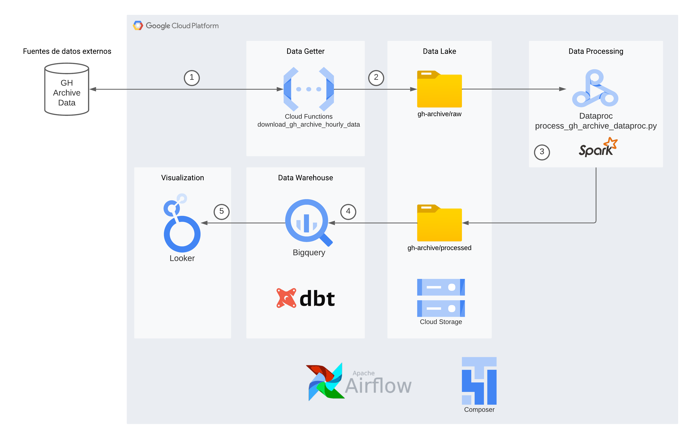

1. Cloud Function is triggered to make an API request to GitHub Archive for a specific day and hour. Then data from GitHub Archive is retrieved.

2. The retrieved data is saved into the Data Lake, inside a Cloud Storage Bucket. The path for raw data is `gh-archive/raw`, saved by day. The above means for each day, we'll have 24 files downloaded (1 per hour).

3. Every day, a pyspark Job is run in Dataproc to process the downloaded data from the previous day. Results are saved in the `gh-archive/processed` path partitioned by year, month, and day, respectively.

4. From BigQuery, the `gh-archive/processed` path is read to create an external table on which to make queries. That table is called `staging_gh_archive_view`, and it's the base for creating other models using DBT:

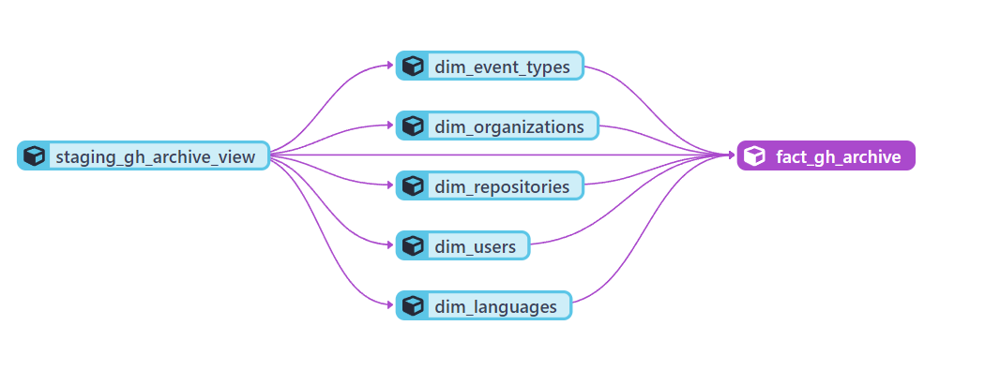

5. Finally, Looker Studio is used to examine the data and to be able to answer relevant questions such as:

    - number of commits per day
    - number of commits per organization, user, and repository

    To watch created dashboard click [here](https://lookerstudio.google.com/reporting/8a72b056-1657-4dd5-a7fa-461e41d7f937/page/in1MD)


# How to Reproduce

This guide explain the steps to reproduce this project.

*Note: Before continuing, please create a fork of this repository.*

## 1. Configure GCP

### 1.1. Create a GCP account

The first thing you need to do is creating a GCP account. To do this go to the main page of Google Cloud [here](https://cloud.google.com/). After that, you need to click on **Start Free** and follow the instructions.

*Note: If you're going to create a GCP account for the first time, you will have $300 in credits, very useful to test this project.*

### 1.2. Create a Service Account file

Click on the following link to create a service account key file:

[Create and delete service account keys](https://cloud.google.com/iam/docs/keys-create-delete)

After you have downloaded the JSON file, create a folder called `credentials` in the root of this project, move the credentials file inside this directoy and finally rename the file as `google_application_credentials.json`

### 1.3. Grant roles

It's necessary to grant specific permission to the `client_email` provided by the JSON file. To do this follow the instructions bellow:

1. Open the `google_application_credentials.json` file and copy the `client_email` value.

2. Log in into the GCP console, then go to IAM-Admin->IAM.

3. Grant al least the following roles:
    - BigQuery Admin
    - Composer Administrator
    - Cloud Composer v2 API Service Agent Extension
    - Cloud Functions Developer
    - Cloud Functions Invoker
    - Dataproc Metastore Metadata User
    - Dataproc Service Agent
    - Dataproc Worker
    - Storage Admin
    - Storage Object Admin

    *Note: Only for testing purposes, you can grant a `Owner` role to the service account*

## 2. Configure DBT

Go  to https://www.getdbt.com/ and creates a free account. After creating your account you need to create your project following the instructions:

1. Choose a name in *Name your project* option.

2. In *Choose a connection*, select BigQuery.

    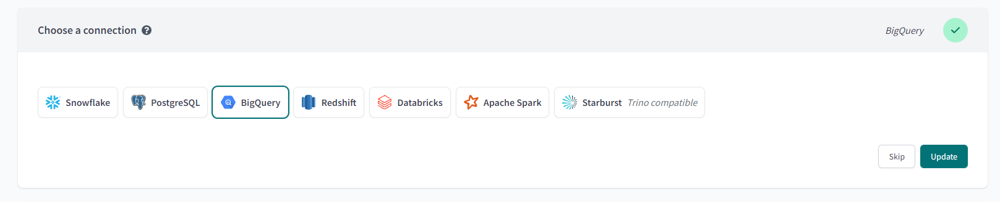

3. In *Configure your environment*, upload the service account file.

    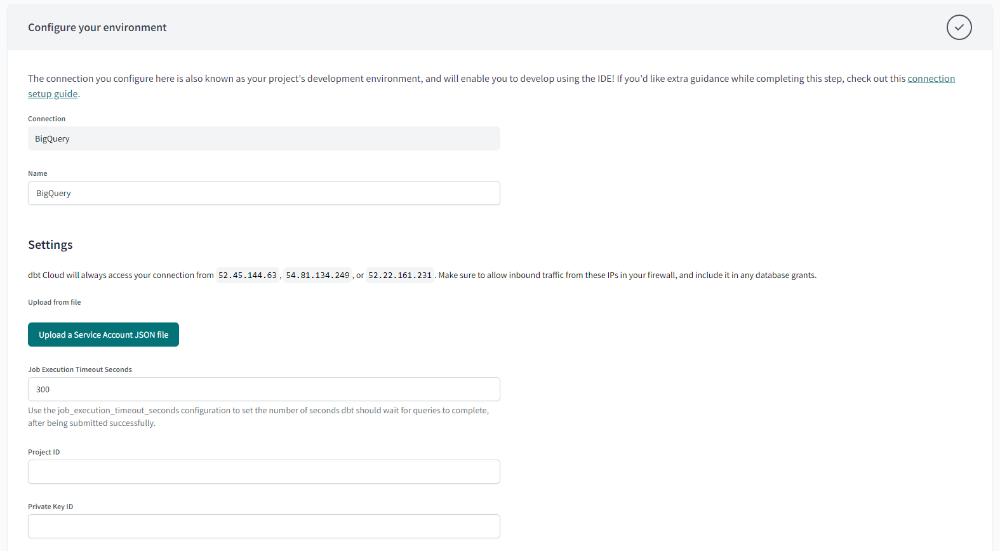

    - You have to configure *Development Credentials*, setting *dataset* field with the value `capstone_project_dw`.

    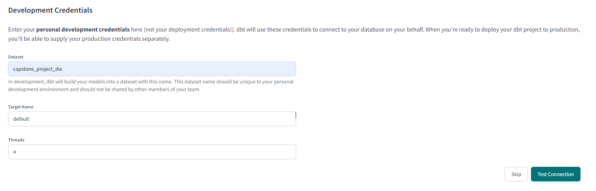

4. In *Setup a Repository*, choose GitHub:

    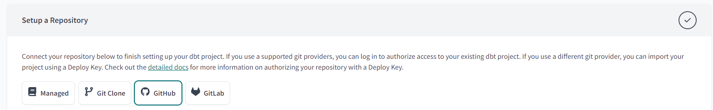

    - Yo need to sign in to github to enable DBT, then you'll able to choose `data-engineer-zoomcamp-capstone-project`

5. Go to *Account Settings*, select project you have created, and change *Project subdirectory* to `dbt/capstone_project_dbt`

6. Select *Develop* tab and click on *initialize dbt project*.

    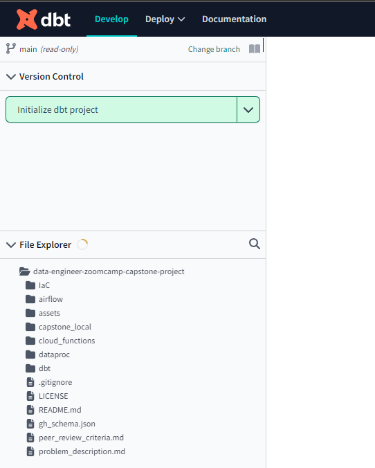

7. Go to Deploy -> Environments and then create an environment, choose a *Name* for this environment, and in *Deployment Credentials* change dataset to `capstone_project_dw`.

    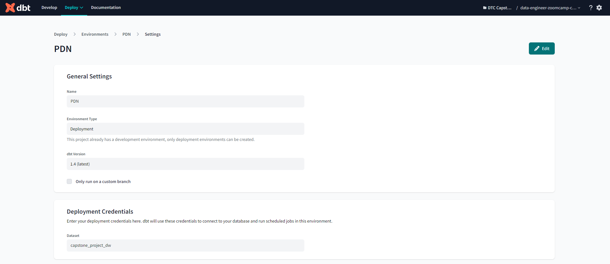

8. Finally, Go to Deploy -> Jobs and then click on *Create Job*
    - Set the environment previously created
    - In commands, set dbt run

    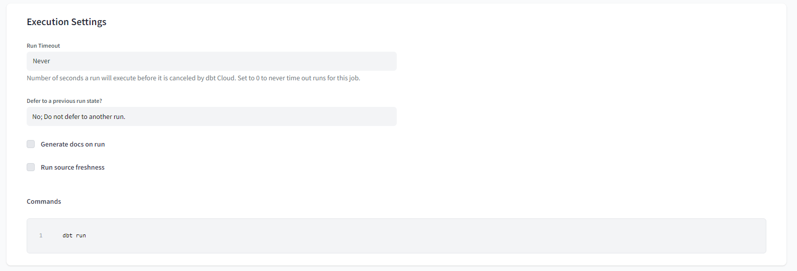

## 3. Run Terraform

First initialize Terraform.
```
terraform init
```

Then, run the following command.
```
terraform apply
```

## 4. Create stage table in BigQuery

Create a table called `staging_gh_archive` inside Bigquery dataset `capstone_project_dw`.

Go to BigQuery, select your project, and then select `capstone_project_dw`, then select *Create Table*

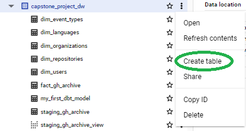

Configure new table like this, and then click on *Create Table*:

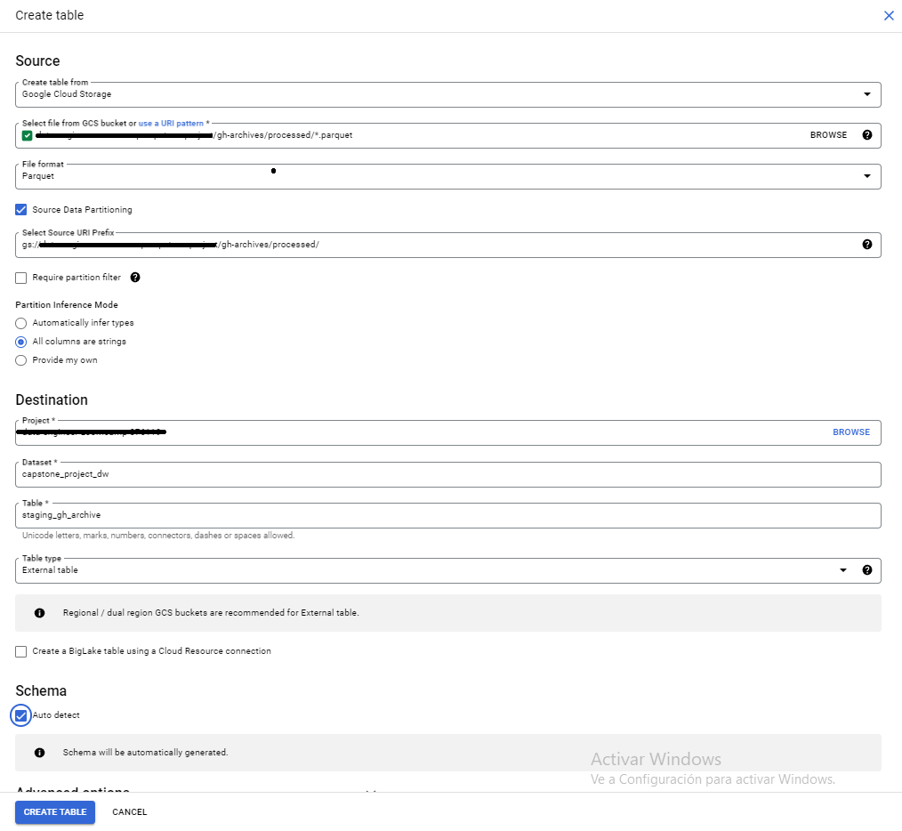


# References:

https://docs.getdbt.com/docs/cloud/git/connect-github

https://docs.getdbt.com/docs/quickstarts/dbt-cloud/bigquery#generate-bigquery-credentials

https://github.com/datamechanics/examples

https://docs.datamechanics.co/docs/docker-images

https://ilhamaulanap.medium.com/data-lake-with-pyspark-through-dataproc-gcp-using-airflow-d3d6517f8168
