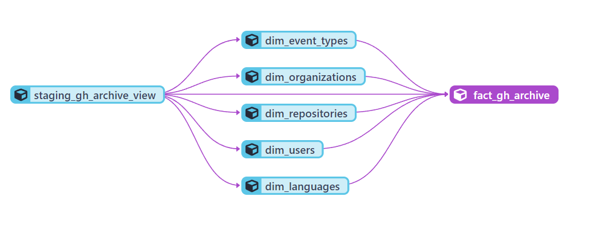

# Problem description

El objetivo en este proyecto es demostrar un caso de ejemplo de como aplicar un Data Pipeline para procesar los datos de GitHub Archive.

Si bien ya existe un ejemplo de un Data Warehouse en BigQuery, la idea principal es desarrollar el data pipeline para solo traerse los datos necesarios para el dashboard.

El resultado en este proyecto es conseguir un Data Ware House para analizar la actividad en GitHub desde enero de 2023. Específicamente, la idea es encontrar cuales son los repositorios que han tenido mayor actividad en este periodo, cuales han sido los usuarios que mas han aportado a los repositorios, asi como las organizaciones y sobretodo los lenguajes que manejan.

Para mas información del dataset consultar:
https://www.gharchive.org/

# Cloud

La nube utilizada es Google Cloud, y los servicios que se utilizan son:

- Cloud Function, para traer la data cruda de GH
- Dataproc: Servicio de Google Cloud para correr un entorno de Spark, se utiliza para correr scripts hechos en pyspark
- Cloud Composer: Apache Airflow

Adicionalmente, se utiliza DBT cloud para construir las diferentes tablas en el Data Warehouse. 

## Estructura del proyecto

La estructura del proyecto, que se implementa utilizando Terraform, es la siguiente:

1. El Cloud Function es triggered para hacer un API request a GitHub Archive para un dia y hora específico.

2. Se recupera la data de GitHub Archive data para ese dia y hora específico.

3. Los datos recuperados se guardan en el Data Lake, dentro de un Cloud Storage Bucket, en la ruta de gh-archive/raw. Los datos se guardan por dia, lo que quiere decir que por cada día, se deben descargar 24 archivos (1 por hora).

4. Cada día, se ejecuta un Job de pyspark en Dataproc para procesar los datos descargados del dia anterior. 

5. Los resultados se guardan en la ruta gh-archive/processed y se particionarán los datos por año, mes y día, respectivamente.

6. Desde BigQuery, se lee la ruta gh-archive/processed para crear una tabla externa soblre la cual hacer queries. Esa tabla se llama staging_gh_archive_view, y es la base para poder crear los otros modelos utilizando DBT, con la cual se crea el siguiente modelo:

7. Finalmente, se utiliza Looker Studio para examinar la data y para poder resolver las preguntas relevantes a nivel de negocio